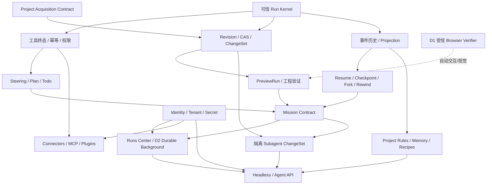

# Web Cursor Agent 完整迭代蓝图

> 基于 `xai-org/grok-build` 固定快照 `c68e39f60462f28d9be5e683d9cbe2c57b1a5027` 与 Web Cursor `5f65130658b64926462e1901396d1775eb52d474` 的只读研究。研究时间：2026-07-16。
>
> 本报告讨论产品能力、架构关系和演进不变量，不定义数据库字段、请求字段或状态 enum。任何实施都必须先形成 Web Cursor 自己的权威契约，不能从 Grok Build 的命名反推 schema。

## 0. 先给结论

上一版报告失败在研究对象选错了：把“Web Cursor 后续完整 Agent 演进”缩成了“当前闭环的可靠性修补”。那些问题真实存在，但只相当于地基，不是产品蓝图。

这次完整阅读后，我对 Grok Build 的判断是：

> **它不是一个带工具的聊天循环，而是一套覆盖“意图、计划、执行、验证、持久工作、用户接管、知识复用、自动化与治理”的 Agent 工作系统。**

它的完整飞轮是：

```text
意图
  → 计划 / 目标契约
  → 工具、任务、子 Agent 执行
  → 收集运行证据
  → 独立验证与纠偏
  → 交付
  → Session / Checkpoint / Fork / Rewind
  → Memory / Rules
  → Skills / Plugins / Headless 自动化复用
```

Web Cursor 当前已经做成了其中非常重要但较短的一段：

```text
意图 → 写 React 项目 → WebContainer 真实运行 → 错误回传 → 自动修复
```

因此后续不应该继续靠“多加几个工具”横向堆功能，而应该把已有闭环向前、向后扩成完整工作系统：

```text
理解设计意图
  → 形成可审阅的任务契约
  → 修改版本化代码
  → 用构建、运行、交互和视觉证据验证
  → 自主修复或明确请求用户输入
  → 交付可解释、可回退、可分叉、可分享的 React 应用版本
  → 将成功方法沉淀为项目知识和可复用工作流
```

### 【核心判断】

✅ **值得实现：把 Web Cursor 升级为“可验证 UI 实现 Agent”。** 这条方向既放大现有 WebContainer、Figma、图片、生图、Showcase 和自修闭环的资产，又能自然延伸到中大型 React 项目、Mission、多 Agent 和 API。

❌ **不建议实现：把 Grok Build 的全部 CLI 能力原样搬进浏览器。** 通用终端、任意语言、开放插件市场、大量斜杠命令和无人监管通用自治会稀释 Web Cursor 的差异化，并提前引入权限、隔离、调度和兼容债务。

### 【关键洞察】

- **数据结构：** 产品核心不再是 `Message`。一次 `AgentRun` 基于 Project Revision 产生 ChangeSet/Preview；一个 Mission 持有长期契约并编排多次 worker/verifier Run，最后才产生 Delivery。消息只是这些事实的展示投影。
- **复杂度：** 最大复杂度来自浏览器、服务端、WebContainer、异步 job 各自维护一部分“任务真相”。必须先建立单一 Run owner 和统一 Effect/Result 协议，不能靠更多 `useEffect` 补偿。
- **风险点：** 如果没有 revision、幂等、取消、来源归因和能力权限，就直接上后台任务、多 Agent、MCP 或插件，现有的串写、晚到结果和错误归因会成倍放大。
- **测试策略：** 只保护真正的不变量与产品闭环：停止后不再写入、冲突不静默覆盖、每个工具恰好一个终态、刷新可恢复、rewind 不覆盖用户后续修改、验证证据对应正确 revision。UI 文案和机械同步不做仪式性测试。

## 1. Web Cursor 应该成为哪一种 Agent 产品

### 1.1 推荐定位

> **Web Cursor 是面向产品、设计和前端创作者的浏览器原生 React/UI Agent：用户说出或展示想要的界面，它负责把意图实现成真实运行、经过验证、可继续迭代、可回退和可分享的应用版本。**

这比“浏览器版 Cursor”更准确，也比“AI Playground”更有上限。

当前需求已经明确主用户是希望快速验证 UI 想法的前端、设计和产品，并把“生成结果能运行且 AI 对错误负责”定义为核心价值。当前代码又已经超越旧需求，拥有多文件、真实 WebContainer、持久项目、图片/Figma、生图和 Showcase。证据见 Web Cursor [REQUIREMENTS.md](<../REQUIREMENTS.md#L11>) 与 [README.zh-CN.md](<../README.zh-CN.md#L15>)。

### 1.2 三层产品战略

不要在“小型 UI 沙箱”和“100+ 文件通用 Coding Agent”之间二选一。更合理的是分三层扩张：

| 层级 | 产品承诺 | 用户得到什么 | 边界 |
|---|---|---|---|
| H1：可验证 UI 实现 Agent | 从自然语言、图片或 Figma 交付经过真实运行验证的 React UI | 快速生成、微调、自修、交付、回退 | React/Rsbuild、浏览器应用、主动用户在环 |
| H2：React 项目 Agent | 先让 Web Cursor 内创建的项目持续长大，并条件性支持导入既有 React 项目 | 项目级任务、计划、ChangeSet、checkpoint、长会话 | 外部仓库接入必须先定义 acquisition/environment contract；仍不承诺任意语言/框架 |
| H3：UI 应用 Agent 平台 | 把成功工作流变成 Mission、recipes、角色化 Agent、连接器和 API | 后台委派、批量任务、外部系统接入、嵌入其他产品 | 只有在 H1/H2 数据证明需求后进入 |

现有 [docs/roadmap.md](<../docs/roadmap.md#L8>) 对可靠运行和大型项目依赖顺序判断基本正确，但它主要是 Agent 基础设施路线，缺少用户如何计划、干预、验收、回退、委派和复用工作的完整产品面。本报告是在它之上补齐产品路线，而不是推翻它。

### 1.3 一句话产品承诺

可以把未来产品对外承诺压缩成：

> **Show or tell Web Cursor what you want. It delivers a verified React version you can inspect, steer, rewind, fork, and share.**

中文即：

> **说出或展示你想要的界面，Web Cursor 交付一个经过验证、可以检查、干预、回退、分叉和分享的 React 版本。**

这句话把差异化从“会写代码”转到“对可验证交付负责”。

### 1.4 北极星指标

建议把当前“一次需求 → 可运行结果成功率”升级为：

> **验证交付成功率：一次用户任务在约定预算内，无需用户手工修复 Agent 引入的代码，最终产出一个与正确项目 revision 绑定、通过所需验证、可继续迭代或交付的结果的比例。**

它至少要求：

1. 结果确实来自本次 AgentRun，而不是旧预览或用户手改。
2. 没有静默覆盖用户新修改。
3. 所有工具调用都恰好闭合一次。
4. 所需的静态、构建、运行、交互或视觉验证已留下证据。
5. 最终版本可 checkpoint、rewind、fork、publish 或 export。
6. Agent 不能完成时明确说明是等待输入、冲突、环境失败、无进展还是预算耗尽。

配套指标分四组：

| 维度 | 指标 |
|---|---|
| 价值 | 首次有效预览耗时、验证交付成功率、二次微调成功率、发布/导出率、继续迭代率 |
| 自治 | 自动修复成功率、验证器一次通过率、错误完成率、平均用户接管次数、Mission 完成率 |
| 可靠 | 停止后晚到写入、重复 terminal、orphan tool result、静默冲突、刷新恢复成功率 |
| 成本 | 每个成功交付的 token、工具调用数、安装/构建/预览耗时、无进展轮数 |

### 1.5 产品入口只需要三种，不复制斜杠命令森林

| 入口 | 何时用 | 默认体验 |
|---|---|---|
| Quick Edit | 小改、明确修复、继续微调 | 直接执行，快速验证，生成轻量 Delivery |
| Planned Build | 多文件、高歧义、可能大返工 | Agent 建议 Plan，用户审阅后执行 |
| Mission | 用户愿意委派一个有验收标准的较大结果 | 先确认契约/预算，再持续执行、验证和交付 |

后台 Task、Verifier、subagent、memory、skills 都是这三种入口背后的能力，不应该要求目标用户先学一套 Agent 术语。Grok 的斜杠命令适合工程师 TUI；Web Cursor 应使用渐进披露，让复杂度只在需要时出现。

### 1.6 Verification Authority：证据不等于判定权

“可验证”必须先回答谁有权宣布通过。Web Cursor 至少有三类完成标准：

| 标准 | 可接受证据 | 谁判定 | 能宣称什么 |
|---|---|---|---|
| 确定性工程结果 | 权威脚本的 type/build、受控 runtime/console、明确函数/协议输出 | 可信控制面或受信 executor | 对应工程检查通过 |
| 可驱动的 UI 功能 | 指定 viewport/初始状态下，由受信浏览器驱动交互并捕获结果；没有受信执行器时由用户操作确认 | 受信 browser verifier 或用户 | 指定路径的交互结果通过 |
| 视觉/审美结果 | 明确参考图/Figma、viewport、页面状态和可观察标准下的可信截图；纯文本审美则需要用户验收 | 用户为最终 authority；自动 visual verifier 只能辅助 | 与明确参考的检查结果，或“等待用户视觉验收” |

必须分开：

- **Evidence capture：** 收集 build log、console、runtime event、交互记录、截图。
- **Oracle：** 根据 acceptance 判断通过/不通过。

C 域执行的是不可信项目代码。它可以上报错误和运行信号，但项目自身的 `postMessage`、DOM 自述或自生成截图不能单独成为“已完成”依据。跨 origin iframe 的父页面也不能假设自己可任意读取 DOM 或截图。

因此自动视觉/交互验证有两条诚实路径：

1. **用户在环：** 工作台展示指定 viewport/状态，用户确认或指出差异。
2. **D1 一次性受信 Browser Verifier：** 在隔离浏览器里驱动页面、截图和收集 page error；它不等于 M6 的 durable runner。

只有纯文本提示、没有明确参考和可观察视觉标准时，系统最多声明“工程/功能检查通过，视觉等待用户验收”，不能宣称“视觉正确”。

### 1.7 Identity、Project Acquisition 与正式 Web 产品边界

当前需求明确承认匿名 `owner id` 可伪造，公网多租户前必须补真鉴权。[REQUIREMENTS.md](<../REQUIREMENTS.md#L37>) 因此路线分两种运行边界：

- **单用户/试用边界：** 可以继续用当前项目模型验证 H1，但不能承诺安全的私有多租户、团队权限或敏感 connector。
- **正式多租户边界：** Publish/private share、后台 Mission、OAuth connector、secret、Headless API 和组织 quota 上线前，必须有真实身份、项目所有权、私有/公开访问、凭据归属与撤销、审计边界。

H2 若要编辑“既有中大型 React 项目”，还必须先形成 **Project Acquisition & Environment Contract**，明确而不是猜测：

- 产品支持哪些进入方式，以及是单次 import、持续 sync 还是 export-only；
- 支持的框架、包管理器、lockfile、monorepo 范围和项目根；
- 哪些 install/type/build/dev 命令是项目权威声明的；
- 私有依赖、网络、环境变量和 secret 如何隔离注入，哪些绝不进入 B/C；
- 外部后端 API 是真实连接、mock 还是明确不支持；
- import/sync 冲突、依赖失败和不支持项目如何诊断。

在这份契约被产品拍板前，H2 应理解为“Web Cursor 内持续成长的 React 项目 Agent”，不能空泛承诺任意已有仓库。

## 2. Grok Build 的完整产品，不只是 Agent Loop

下面将上游能力按用户价值重建，而不是按 crate 或命令罗列。成熟度口径：A = 已交付且入口完整；B = 已交付但有明确能力边界；C = feature-gated/experimental/alpha；D = 文档明确未交付。

| 系统 | 成熟度/入口 | 已交付部分 | 明确边界 | Web Cursor 采用部分 |
|---|---|---|---|---|
| 工作台与 Steering | A / 默认交互 | scrollback、工具/diff/task、queue/send-now/cancel | TUI 交互，不适合直接复制 Web UX | 控制语义与 Run timeline |
| Plan | B / 用户或 Agent 触发 | 只读探索、计划预览、行评、审批、持久化 | shell/write-capable subagent 可绕过门禁 | Web 计划评审 + 全 executor gate |
| Goal/Mission | C / feature-gated | 状态机、planner、worker、verifier panel、strategist、budget、summary | 非默认；上游视觉目标仍依赖有限 evidence，内部计划不面向用户 | 用户可见 UI Mission contract + 可信 browser evidence |
| Session/Fork/Rewind | A / 默认持久化 | resume、搜索、fork、文件+对话 rewind、compaction | 本地文件/worktree 模型 | Revision/ChangeSet/checkpoint |
| Background/Task | B / 工具与命令 | task id、output/wait/kill、monitor、loop、scheduler definition | 不等于退出 pager 后 Agent 仍存活 | 先统一长任务，durable 后置 |
| Dashboard | B / dashboard 入口 | needs-input 排序、dispatch、peek、reply/approve/stop | 只管理当前 pager 进程 | Runs Center 交互，不冒充 durable supervisor |
| Subagent | A / 默认可用、可关闭 | 角色、capability、resume、background、worktree、可见 transcript | 最大深度一层；并行仍有合并成本 | 少量 UI 角色 + 隔离 ChangeSet |
| Rules / Skills | A / 项目与用户作用域 | 层级规则、来源 inspect、自动/手动 skill、allowed tools | CLI/文件式 authoring | Project Contract + 官方 Recipes |
| Memory | C / experimental、默认关闭 | 多作用域、reviewed remember、flush/dream、hybrid retrieval、staleness | 实验能力；自动保存不等于权威事实 | 显式审阅 memory，契约分层 |
| Plugins / MCP | A / 扩展中心与配置 | trust/enable 分离、来源、OAuth、远程/本地工具、doctor | 执行面和维护面大 | 权限/来源成熟后做受控 connector |
| Hooks | B / 配置 | 完整 lifecycle、script/HTTP、UI 管理 | 失败多为 fail-open，不能做安全边界 | 先内部 typed events，外部后置 |
| Headless / ACP | A / CLI与协议入口 | 同一 runtime、create/load/resume、stream、permission、CI/IDE | 对 Web Cursor 不是近期刚需 | 先内部 versioned protocol，再开放 API |
| External OTel | C / alpha、双重 opt-in | typed metrics/events、redaction、content-free default | telemetry 可丢，不能做产品事实 | 领域事件先持久，遥测异步导出 |
| 跨进程 durable supervisor | D / 明确未来 Phase | 未交付 | 当前 Dashboard process-local | 只能等 D2 runner 后建设 |

### 2.1 交互式工作台：让用户随时知道 Agent 在做什么

Grok Build 的基础界面不是“聊天气泡 + loading”，而是把 thought、tool call、diff、任务和权限请求放进同一工作流。用户可以引用文件、查看内联改动、观察任务状态并随时接管。[Getting Started](https://github.com/xai-org/grok-build/blob/c68e39f60462f28d9be5e683d9cbe2c57b1a5027/crates/codegen/xai-grok-pager/docs/user-guide/01-getting-started.md#L72-L149)

真正优秀的地方是运行中的 steering 语义：

- 普通发送是**排队**，不打断当前工作。
- “立即发送”是**取消当前 turn 后发送**。
- 等待后台任务或子 Agent 时，用户消息可以立即解除等待。
- 后台任务、子 Agent 与其余队列不会因为当前 turn 被取消而被错误清空。

这不是快捷键细节，而是 Agent 产品的控制模型：**排队、插话、停止、取消当前步骤、取消整项任务必须是不同动作。** [Keyboard Shortcuts](https://github.com/xai-org/grok-build/blob/c68e39f60462f28d9be5e683d9cbe2c57b1a5027/crates/codegen/xai-grok-pager/docs/user-guide/03-keyboard-shortcuts.md#L172-L192)

对 Web Cursor 的指导：聊天输入框未来至少需要“排在当前任务后”“中断并按新要求继续”“仅补充背景，不改变当前步骤”“停止整个 Run”四种明确语义。不能继续把 `AbortController`、停止按钮和新消息都压成一个模糊的 busy 状态。

### 2.2 Plan：价值不在生成计划，而在用户可以审阅和修订

Grok 的 Plan mode 会先只读探索，只有计划文件可写；计划完成后展示独立审批界面。用户可以批准、要求修改、选择具体行添加评论，计划状态还会跨重启和 compaction 保留。它也明确规定小任务不应强制 plan。[Plan Mode](https://github.com/xai-org/grok-build/blob/c68e39f60462f28d9be5e683d9cbe2c57b1a5027/crates/codegen/xai-grok-pager/docs/user-guide/19-plan-mode.md#L7-L16) [Plan Approval](https://github.com/xai-org/grok-build/blob/c68e39f60462f28d9be5e683d9cbe2c57b1a5027/crates/codegen/xai-grok-pager/docs/user-guide/19-plan-mode.md#L65-L123)

好产品方案在于：

1. 只有高歧义、高返工成本的任务进入 Plan。
2. Plan 是独立、可持久、可评论的产品对象，不是一段 assistant 文本。
3. “同意目标”和“同意实现方案”分开。
4. 实施前的审批是成本控制点，也是信任建立点。

对 Web Cursor 的指导：复杂页面、设计系统改造、跨多文件功能应提供可编辑计划；按钮改色、文案调整等直接执行。计划应描述用户结果、受影响区域、已知约束和验证方式，不应把未经确认的文件名或架构猜测冻结成契约。

需要明确不照搬的缺陷：上游文档承认 Plan 对 shell 写入与 write-capable subagent 并非完整安全边界。[Plan Mode limitations](https://github.com/xai-org/grok-build/blob/c68e39f60462f28d9be5e683d9cbe2c57b1a5027/crates/codegen/xai-grok-pager/docs/user-guide/19-plan-mode.md#L126-L135) Web Cursor 若做 Plan，所有 mutation executor 都必须受同一服务端 gate 约束。

### 2.3 Session、Fork、Rewind：把 Agent 对话升级成可继续的工作

Grok 的 session 保存完整历史、工具调用与结果、TODO、文件快照、用量和子 Agent。`updates.jsonl` 是权威更新流，summary、chat history、rewind points、signals 等是不同用途的持久材料。用户可以搜索恢复、fork、重命名、compact，并把文件和对话一起 rewind 到过去的 prompt。[Sessions](https://github.com/xai-org/grok-build/blob/c68e39f60462f28d9be5e683d9cbe2c57b1a5027/crates/codegen/xai-grok-pager/docs/user-guide/17-sessions.md#L7-L39) [Fork and Rewind](https://github.com/xai-org/grok-build/blob/c68e39f60462f28d9be5e683d9cbe2c57b1a5027/crates/codegen/xai-grok-pager/docs/user-guide/17-sessions.md#L99-L140)

这里最值得借鉴的产品原则是：

> **一次 Agent 工作不是一串消息，而是一条可以恢复、分叉、撤销和审计的工作历史。**

对 Web Cursor 的指导：

- `Conversation` 保留不同讨论线索；`AgentRun` 表示一次具体任务；`Project Revision` 表示代码事实。
- Fork 应从某个 revision 与上下文 checkpoint 创建新方向，不应让两个会话共享一个可被同时覆盖的隐式最新代码。
- Rewind 必须基于 ChangeSet/CAS，只撤销 Agent 造成的变化，不覆盖用户之后的修改。
- Delivery、公开 Showcase、ZIP 都必须指向不可变 revision，不能指向“当前项目”。

### 2.4 Todo、Task 与 Background：把长工作从一条回复中拆出来

Grok 把 foreground command、background command、subagent、monitor 和定时 loop 统一放进 Tasks pane。后台 command 有 task id，可读输出、等待任一/全部、终止；当前 foreground task 也能转后台。monitor 与 scheduler 允许事件或时间唤醒 Agent。[Background Tasks](https://github.com/xai-org/grok-build/blob/c68e39f60462f28d9be5e683d9cbe2c57b1a5027/crates/codegen/xai-grok-pager/docs/user-guide/20-background-tasks.md#L7-L60) [Tasks Pane](https://github.com/xai-org/grok-build/blob/c68e39f60462f28d9be5e683d9cbe2c57b1a5027/crates/codegen/xai-grok-pager/docs/user-guide/20-background-tasks.md#L150-L188)

对 Web Cursor 的价值不是做通用 cron，而是统一现有和未来的长任务：

- 生图；
- npm install/build；
- 浏览器/视觉验证；
- 发布与导出；
- Mission worker；
- 后续 subagent。

近期可以先把这些统一成用户可见的 Task/Progress 模型；“关掉页面仍继续”则必须等 D2 持久 runner、租约、重试和幂等具备后再承诺。浏览器 WebContainer 不是持久后台服务。

### 2.5 Goal：一套成熟的 Mission 闭环

`/goal` 是这次研究中最重要、也最容易被第一版遗漏的能力。它不是“写一个 Todo 列表”，而是完整的长期目标系统：

```text
用户目标
  → Planner 把目标冻结为结果契约
  → Worker 跨 turn 执行
  → 对抗式 Verifier 检查证据并尝试推翻完成
  → 未达成则把 gap 返回 Worker
  → 连续失败时 Strategist 改变 HOW，不改变 WHAT
  → 达成 / 阻塞 / 无进展 / 基础设施失败 / 预算耗尽
  → Summarizer 形成交付摘要
```

其实现有几个非常好的设计：

- `GoalTracker` 是无异步 I/O 的纯状态机，由 `SessionActor` 单 owner 持有。[goal_tracker.rs](https://github.com/xai-org/grok-build/blob/c68e39f60462f28d9be5e683d9cbe2c57b1a5027/crates/codegen/xai-grok-shell/src/session/goal_tracker.rs#L1-L35)
- 生命周期显式区分 planning/executing，以及用户暂停、backoff、无进展、基础设施失败、blocked、预算受限、完成。[goal_tracker.rs](https://github.com/xai-org/grok-build/blob/c68e39f60462f28d9be5e683d9cbe2c57b1a5027/crates/codegen/xai-grok-shell/src/session/goal_tracker.rs#L37-L86)
- 计划只在创建时生成一次，要求 objective、acceptance criteria、verification plan、non-goals 清晰，并强调冻结的是可观察结果而非具体实现。[goal_planner_prompt.md](https://github.com/xai-org/grok-build/blob/c68e39f60462f28d9be5e683d9cbe2c57b1a5027/crates/codegen/xai-grok-shell/src/session/templates/goal_planner_prompt.md#L1-L16) [Outcome contract](https://github.com/xai-org/grok-build/blob/c68e39f60462f28d9be5e683d9cbe2c57b1a5027/crates/codegen/xai-grok-shell/src/session/templates/goal_planner_prompt.md#L47-L61)
- Verifier 默认尝试反驳完成，检查真实产物与已捕获证据；重复验证又有 anti-ratchet 规则，防止每轮不断抬高标准导致永远完不成。[goal_verifier_prompt.md](https://github.com/xai-org/grok-build/blob/c68e39f60462f28d9be5e683d9cbe2c57b1a5027/crates/codegen/xai-grok-shell/src/session/templates/goal_verifier_prompt.md#L1-L34)
- 检测到相同 gap 没进展时会暂停，连续验证失败可触发 strategist 改变执行策略；Agent 过早停止时 continuation directive 会重新推进。[goal_tracker.rs](https://github.com/xai-org/grok-build/blob/c68e39f60462f28d9be5e683d9cbe2c57b1a5027/crates/codegen/xai-grok-shell/src/session/goal_tracker.rs#L16-L30) [goal_continuation_directive.md](https://github.com/xai-org/grok-build/blob/c68e39f60462f28d9be5e683d9cbe2c57b1a5027/crates/codegen/xai-grok-shell/src/session/templates/goal_continuation_directive.md#L1-L23)

对 Web Cursor 的指导：把它产品化为 **Mission Mode**，并针对 UI 工作做专门化：

- Objective：用户要完成的页面或交互结果。
- Acceptance：功能、视觉、响应式、可访问性、已知浏览器范围。
- Non-goals：本轮明确不做什么。
- Evidence plan：build/runtime、关键交互、截图/视觉比较、console、产物。
- Worker：实现和修复。
- Verifier：独立读取 revision、预览和证据，不相信 Worker 的自述。
- Completion：只有证据满足契约才能完成；否则显示 gap、blocked、budget 或 needs input。

Mission v1 可以在用户保持页面打开时运行；关闭页面后继续属于后续持久执行阶段，不能一开始就把两者捆死。

### 2.6 Dashboard：多 Agent 的真正产品不是 spawn，而是控制平面

Grok 的 Dashboard 把 top-level sessions 按 `Needs input → Working → Idle → Inactive → Completed → Failed` 排序；用户可以批量 dispatch、新开或附着、peek 最新输出、回答权限/问题、给 busy Agent 排队消息、停止、固定、重命名和筛选。[Dashboard](https://github.com/xai-org/grok-build/blob/c68e39f60462f28d9be5e683d9cbe2c57b1a5027/crates/codegen/xai-grok-pager/docs/user-guide/23-dashboard.md#L23-L67) [Peek and reply](https://github.com/xai-org/grok-build/blob/c68e39f60462f28d9be5e683d9cbe2c57b1a5027/crates/codegen/xai-grok-pager/docs/user-guide/23-dashboard.md#L206-L288)

优秀之处是它围绕“人现在最该处理什么”设计，而不是围绕 Agent 数量设计。`Needs input` 永远优先，后台 task 存活时 Agent 仍算 Working；用户可以不进入完整 transcript 就快速回复。

但文档明确说明当前 Dashboard 只管理本 pager 进程拥有的 Agent；退出后仍存活的 supervisor 是未交付的 Phase 4。[Dashboard scope](https://github.com/xai-org/grok-build/blob/c68e39f60462f28d9be5e683d9cbe2c57b1a5027/crates/codegen/xai-grok-pager/docs/user-guide/23-dashboard.md#L323-L351)

对 Web Cursor 的指导：未来做 **Runs / Missions Center**，优先展示：

- 等待用户输入或权限；
- 正在计划、实现、验证或等待外部任务；
- 无进展、冲突、环境失败或预算耗尽；
- 已完成且可交付。

不要先做“多 Agent 聊天气泡”。先有可恢复 Run、Task、权限、隔离 ChangeSet 和 needs-input 状态，再做控制中心。

### 2.7 Subagents：角色、能力、隔离和可见性缺一不可

Grok 的 child agent 有独立上下文，内建 general-purpose、explore、plan 等角色；persona 可以改变行为；capability mode 可限制为 read-only/read-write/execute/all；任务可后台运行、从已有 child context 继续，并可选择隔离 worktree。父会话、任务面板和 child transcript 都能看见其生命周期。[Subagents](https://github.com/xai-org/grok-build/blob/c68e39f60462f28d9be5e683d9cbe2c57b1a5027/crates/codegen/xai-grok-pager/docs/user-guide/16-subagents.md#L44-L69) [Capabilities and isolation](https://github.com/xai-org/grok-build/blob/c68e39f60462f28d9be5e683d9cbe2c57b1a5027/crates/codegen/xai-grok-pager/docs/user-guide/16-subagents.md#L141-L199) [Visibility](https://github.com/xai-org/grok-build/blob/c68e39f60462f28d9be5e683d9cbe2c57b1a5027/crates/codegen/xai-grok-pager/docs/user-guide/16-subagents.md#L241-L287)

对 Web Cursor 的合适角色不是泛化的 N 个 coder，而是少量、结果边界清楚的 UI 工作角色：

1. **Design Analyst：** 读取 Figma/图片/现有设计规则，产出设计约束，不直接改代码。
2. **Implementer：** 在隔离 ChangeSet 上实现。
3. **Runtime Verifier：** 检查 build、console、交互路径。
4. **Visual QA：** 对照目标截图/Figma 检查布局和关键视觉差异。

第一阶段最多用“主 Agent + 独立 verifier”；只有收益被 eval 证明后才并行多个 writer。writer 之间必须用独立 revision/ChangeSet 汇合，不能共享 last-write-wins 文件系统。

### 2.8 Rules、Memory 与 Context：权威约束和经验不能混为一谈

Grok 支持全局、仓库、子目录规则，深层规则优先；Agent 触及新目录时还能动态发现。`grok inspect` 会显示加载来源和 token 数。[Project Rules](https://github.com/xai-org/grok-build/blob/c68e39f60462f28d9be5e683d9cbe2c57b1a5027/crates/codegen/xai-grok-pager/docs/user-guide/12-project-rules.md#L42-L76) [Inspecting rules](https://github.com/xai-org/grok-build/blob/c68e39f60462f28d9be5e683d9cbe2c57b1a5027/crates/codegen/xai-grok-pager/docs/user-guide/12-project-rules.md#L186-L214)

Memory 则是实验能力，分 global/workspace/session；Markdown 是权威文本，SQLite 做检索索引；有确定性的自动保存，也有 `/remember` 审阅后保存、`/flush` 富总结、`/dream` 整理、hybrid search、时间衰减、MMR 和 staleness 提示。[Memory Storage](https://github.com/xai-org/grok-build/blob/c68e39f60462f28d9be5e683d9cbe2c57b1a5027/crates/codegen/xai-grok-pager/docs/user-guide/13-memory.md#L82-L113) [Remember and browse](https://github.com/xai-org/grok-build/blob/c68e39f60462f28d9be5e683d9cbe2c57b1a5027/crates/codegen/xai-grok-pager/docs/user-guide/13-memory.md#L131-L213) [Retrieval](https://github.com/xai-org/grok-build/blob/c68e39f60462f28d9be5e683d9cbe2c57b1a5027/crates/codegen/xai-grok-pager/docs/user-guide/13-memory.md#L250-L324)

对 Web Cursor 应严格拆成两层：

| 层 | 内容 | 是否权威 | 写入方式 |
|---|---|---|---|
| Project Contract / Rules | 技术栈、脚本、依赖、设计 token、组件规范、品牌与交互硬约束 | 是 | 用户或可信导入源明确确认，版本化 |
| Project Memory | 用户偏好、已验证修法、过去决策、常用页面模式 | 否 | 默认可审阅、可编辑、可删除，带 provenance 与 staleness |

不要让 LLM 自动总结出的 memory 覆盖项目契约；不要把未知设计值补成默认值。近期先做显式“记住这个设计规则”和来源查看，再考虑自动检索、向量和跨项目记忆。

### 2.9 Skills、Plugins、MCP、Hooks：从成功方法到平台生态

四者解决的问题不同：

- **Skills：** 可复用的提示、检查单和工作流，可自动触发或用户显式调用，有作用域、工具白名单、模型配置和来源。[Skills](https://github.com/xai-org/grok-build/blob/c68e39f60462f28d9be5e683d9cbe2c57b1a5027/crates/codegen/xai-grok-pager/docs/user-guide/08-skills.md#L7-L15) [Invocation](https://github.com/xai-org/grok-build/blob/c68e39f60462f28d9be5e683d9cbe2c57b1a5027/crates/codegen/xai-grok-pager/docs/user-guide/08-skills.md#L147-L209)
- **Plugins：** 打包 skills、commands、agents、hooks、MCP、LSP；启用和信任分离，用户能查看组件来源。[Plugins](https://github.com/xai-org/grok-build/blob/c68e39f60462f28d9be5e683d9cbe2c57b1a5027/crates/codegen/xai-grok-pager/docs/user-guide/09-plugins.md#L7-L20) [Trust and inspect](https://github.com/xai-org/grok-build/blob/c68e39f60462f28d9be5e683d9cbe2c57b1a5027/crates/codegen/xai-grok-pager/docs/user-guide/09-plugins.md#L234-L258)
- **MCP：** 接入外部标准化工具服务器，支持本地/远程 transport、项目作用域、OAuth、诊断、运行时开关、命名空间与动态发现。[MCP](https://github.com/xai-org/grok-build/blob/c68e39f60462f28d9be5e683d9cbe2c57b1a5027/crates/codegen/xai-grok-pager/docs/user-guide/07-mcp-servers.md#L7-L17) [Discovery and OAuth](https://github.com/xai-org/grok-build/blob/c68e39f60462f28d9be5e683d9cbe2c57b1a5027/crates/codegen/xai-grok-pager/docs/user-guide/07-mcp-servers.md#L161-L222)
- **Hooks：** 在 session、prompt、tool、permission、stop、subagent、compact 等生命周期上运行脚本或 HTTP 回调。[Hooks](https://github.com/xai-org/grok-build/blob/c68e39f60462f28d9be5e683d9cbe2c57b1a5027/crates/codegen/xai-grok-pager/docs/user-guide/10-hooks.md#L80-L120)

Web Cursor 的采用顺序应是：

```text
内部生命周期事件
  → 官方受控 UI recipes / skills
  → 少量第一方连接器（Figma、发布、数据）
  → 稳定 capability/permission/provenance
  → 远程 MCP / 受信插件
  → 最后才考虑开放市场与 hooks
```

优先产品化的 recipes 可以是：

- 从 Figma 节点实现页面；
- Build + Runtime + Visual QA；
- 生成 2～3 个隔离视觉方案并比较；
- 响应式检查；
- Accessibility review；
- 发布前交付检查；
- 从 Showcase fork 后改造成新品牌。

### 2.10 Headless 与 ACP：Agent Core 可以成为服务，而不被某个 UI 绑死

Grok 的 headless 模式支持 plain/json/streaming-json、工具 allow/deny、权限规则、最大轮数、sandbox、session create/resume、CI/batch、退出码和中断恢复。高级 flag 还覆盖 agent definition、self-check、best-of-N、worktree 等。[Headless](https://github.com/xai-org/grok-build/blob/c68e39f60462f28d9be5e683d9cbe2c57b1a5027/crates/codegen/xai-grok-pager/docs/user-guide/14-headless-mode.md#L7-L116) [Output and sessions](https://github.com/xai-org/grok-build/blob/c68e39f60462f28d9be5e683d9cbe2c57b1a5027/crates/codegen/xai-grok-pager/docs/user-guide/14-headless-mode.md#L116-L278) [Automation](https://github.com/xai-org/grok-build/blob/c68e39f60462f28d9be5e683d9cbe2c57b1a5027/crates/codegen/xai-grok-pager/docs/user-guide/14-headless-mode.md#L318-L470)

ACP 则把 Agent 暴露为持久 JSON-RPC 进程，客户端能 create/load/resume session、接收 text/thought/tool/plan 结构化事件、回答权限，并通过扩展方法使用 fs/git/worktree/search/terminal/rewind/compact 等能力。[ACP](https://github.com/xai-org/grok-build/blob/c68e39f60462f28d9be5e683d9cbe2c57b1a5027/crates/codegen/xai-grok-pager/docs/user-guide/15-agent-mode.md#L7-L116) [Extensions](https://github.com/xai-org/grok-build/blob/c68e39f60462f28d9be5e683d9cbe2c57b1a5027/crates/codegen/xai-grok-pager/docs/user-guide/15-agent-mode.md#L116-L160)

对 Web Cursor 的指导不是立即兼容 ACP，而是先形成一个**版本化的内部 Agent Protocol**，让工作台、后台 runner、eval、未来 API 使用同一语义。只有真实的外部嵌入需求出现后，再开放：

- `Create Mission`；
- `Resume/Inspect Run`；
- `Stream Events`；
- `Answer/Approve`；
- `Fetch Delivery/Artifact`。

架构上尤其值得学的是：Headless 没有另写一套 Agent，而是执行同一 ACP 生命周期；structured output 只接受 Agent 已验证的结构化结果，不再从最终文本里猜 JSON。[Headless shares runtime](https://github.com/xai-org/grok-build/blob/c68e39f60462f28d9be5e683d9cbe2c57b1a5027/crates/codegen/xai-grok-pager/src/headless.rs#L1-L18) [No text-to-JSON guessing](https://github.com/xai-org/grok-build/blob/c68e39f60462f28d9be5e683d9cbe2c57b1a5027/crates/codegen/xai-grok-pager/src/headless.rs#L344-L414)

### 2.11 Governance 与 Observability：自治越强，越需要可见边界

Grok 将 tool permissions、sandbox、plugin trust、usage/privacy 与外部 OTel 做成独立产品面。OTel 要求双重 opt-in，默认不记录 prompt/content，使用封闭的 typed attributes 和导出校验；指标覆盖 session、token、turn、tool decision/error，事件覆盖 permission、MCP、skill/plugin、compaction、subagent、model switch 等。[Monitoring](https://github.com/xai-org/grok-build/blob/c68e39f60462f28d9be5e683d9cbe2c57b1a5027/crates/codegen/xai-grok-pager/docs/user-guide/24-monitoring-usage.md#L117-L181)

Web Cursor 后续要把权限按能力而不是按工具名字组织：

- 读取项目；
- 修改代码；
- 外部网络/连接器；
- 生成或上传资产；
- 发布公开结果；
- 启动后台任务；
- 使用高成本模型或多 Agent。

运行观测则必须回答：哪个用户动作创建了哪个 Run、用了哪个 revision、每个工具做了什么、在哪一层失败、验证证据是什么、为什么完成/暂停、花了多少成本。源码、prompt、附件默认不进入外部遥测。

用户可见 timeline 不能直接依赖 OTel：上游远端 observability 是 fire-and-forget，关闭阶段允许丢失，这是合理的遥测取舍，却不能成为产品事实源。[Observability delivery semantics](https://github.com/xai-org/grok-build/blob/c68e39f60462f28d9be5e683d9cbe2c57b1a5027/crates/common/xai-computer-hub-sdk/src/observability.rs#L23-L32) Web Cursor 应先持久化领域 Event，再异步导出 telemetry。

### 2.12 Models 与 Media：能力存在，但不应抢占 Agent 主线

Grok 允许在 session 中切模型和 reasoning effort，并适配 OpenAI Chat、OpenAI Responses、Anthropic Messages、自托管/第三方 endpoint 与企业 gateway。[Custom Models](https://github.com/xai-org/grok-build/blob/c68e39f60462f28d9be5e683d9cbe2c57b1a5027/crates/codegen/xai-grok-pager/docs/user-guide/11-custom-models.md#L19-L68) 它也把图片、视频生成纳入同一产品命令面，而非外部附属工具。[Media commands](https://github.com/xai-org/grok-build/blob/c68e39f60462f28d9be5e683d9cbe2c57b1a5027/crates/codegen/xai-grok-pager/docs/user-guide/04-slash-commands.md#L332-L348)

对 Web Cursor：

- 生图已经是现有差异化资产，应统一进入 Task/Asset/Revision/Delivery，而不是作为聊天卡片特例。
- 模型层先做内部 adapter、能力声明、成本/延迟路由和可回放的 model identity；是否开放 BYOK/任意 provider 取决于真实用户需求。
- “换模型”“persona 市场”不能优先于 verified delivery；用户买单的是结果，不是模型下拉框数量。

## 3. Grok Build 最好的产品设计

如果只挑真正能指导 Web Cursor 的设计，而不是功能数量，我认为有十项。

### 3.1 用户控制权有精细语义

排队、插话、取消 turn、停止任务、保留后台工作彼此区分。它承认用户在 Agent 运行中仍会改变主意，这是 Agent UX 的基本事实。

### 3.2 Plan 是审阅界面，不是一段漂亮文字

计划的价值来自“可选择、可评论、可要求修改、批准后才改变代码”，而不是 Agent 能列几个步骤。

### 3.3 Session 是工作单位，Message 只是展示单位

resume、fork、rewind、compact、export 都围绕 session 及其文件状态，而不是围绕 chat history 做表面文章。

### 3.4 Goal 把“完成”从 Agent 自述变成证据判定

目标契约冻结 WHAT，worker 选择 HOW，独立 verifier 主动找反例，strategist 在无进展时改变策略，预算和阻塞显式终止。这是比“while 还没报错就继续”成熟得多的自治模型。

### 3.5 Needs input 是控制中心的最高优先级

多 Agent 产品首先解决人的注意力调度：谁在等我、为什么等、我能否在不进入完整会话的情况下回答。

### 3.6 子 Agent 必须可见、受限、可隔离

角色、工具能力、上下文继承、工作区隔离和 transcript 可见性共同组成可信 delegation；只有 spawn 没有这些只是黑盒并发。

### 3.7 Rules 与 Memory 分层，并强调 provenance

项目硬约束与经验性记忆来源不同、权威性不同。用户能检查加载来源、编辑和删除，而不是让模型背后积累不可解释的“个性”。

### 3.8 Extension 的启用与信任分离

安装/发现一个插件不等于允许其执行代码。来源、组件清单、权限和信任状态可检查，这一点比“支持插件”本身更重要。

### 3.9 一个 Agent Core 服务多个表面

TUI、headless 和 ACP 共用 session、tool、permission 和 event 语义，说明核心不是 UI 回调集合，而是独立运行系统。

### 3.10 失败、暂停和成本是正常状态，不是假异常

无进展、基础设施失败、blocked、budget limited、needs input 都能被用户理解和恢复。成熟 Agent 不应该用“失败了，请重试”吞掉这些差异。

## 4. Web Cursor 已经拥有的独特资产

完整路线不等于从零重做。当前项目已经有六块很难得的基础：

1. **真实闭环：** 服务端手写模型—工具循环，浏览器执行 preview tool，再把真实结果回填继续修复。入口见 [app/api/chat/route.ts](<../app/api/chat/route.ts#L169>) 与 [hooks/useChat.ts](<../hooks/useChat.ts#L421>)。
2. **三执行域：** key、LLM 与可信工具在 A；浏览器编排在 B；不可信代码在 WebContainer/iframe 的 C。约束见 [CLAUDE.md](<../CLAUDE.md#L8>)。
3. **真实 React 项目运行：** 多文件 Rsbuild 项目、`npm install`、dev server、runtime feedback 已经存在，而不是静态 JSX 演示。[README.zh-CN.md](<../README.zh-CN.md#L21>)
4. **多模态设计入口：** 图片理解、项目资产、生图任务、Figma OAuth/node 读取让产品天然适合 UI Agent，而不是通用 shell Agent。
5. **项目/会话/文件持久化：** Project 与 Conversation 已经分离，同项目多会话共享代码，为后续 revision/run 奠定基础。
6. **交付雏形：** Showcase 已有浏览器构建 artifact 和只读工作台，可演进为 revision-bound publish/fork，而不是另造发布系统。

这些资产决定了 Web Cursor 最有品味的路线是：**向上补计划、任务、Mission 和控制权，向下补 revision、验证、事件历史和执行治理，向外补交付、知识与工作流复用。**

## 5. 北极星产品的九条黄金工作流

能力地图必须先从用户工作开始，否则很容易重新退化成基础设施清单。

### 5.1 快速改一处：零仪式的即时迭代

```text
“把主按钮改成品牌蓝，并调整 hover”
  → Agent 读取当前 revision 和设计规则
  → 精确 ChangeSet
  → 快速静态检查 + 增量 Preview
  → Run Summary 展示改动与结果；M3 后升级为 verified Delivery
```

这类任务不进入 Plan，不启动 subagent，不跑完整 Mission。目标是最短路径与即时反馈。

### 5.2 复杂功能：先把方向说清楚再动代码

```text
“给后台增加可筛选订单表格与详情抽屉”
  → Agent 判断任务高歧义
  → 只读探索
  → 提交结果、范围、关键交互和验证计划
  → 用户行内评论 / 要求修改 / 批准
  → 执行 Todo
  → 逐层验证
  → Delivery
```

计划 UI 应支持批准、评论、退回修改和放弃；不是在 chat 中让用户回复“可以”。

### 5.3 运行中改主意：不丢消息、不误取消

用户在 Agent 工作时可以：

- 把“完成后再把表头固定”排到队尾；
- 用“先别做移动端”作为非中断补充；
- 用“停下，先解决数据结构”中断当前 turn 并立即切换方向；
- 停止整个 Run，确保之后没有晚到 mutation。

队列中的消息、当前 turn 和整个 Run 必须有不同身份与取消边界。

### 5.4 从设计到实现：多模态输入不是附件，而是权威来源

```text
Figma node / 参考图 / 品牌文档
  → Design Analyst 提取明确设计事实与不确定项
  → 用户确认约束
  → Implementer 修改代码
  → Runtime + Visual QA
  → 展示与目标的关键差异和剩余 gap
```

Figma 缺失字段必须显式省略或报错；图片中无法判断的值必须标注不确定，不能为“看起来能跑”猜 padding、颜色或枚举。

### 5.5 自主修复：从“页面没报错”升级为“目标确实成立”

验证梯度：

```text
项目契约
  → typecheck（仅当权威脚本存在）
  → build
  → browser runtime / console
  → 关键交互
  → 视觉证据
  → acceptance verifier
```

任何一层失败都产生结构化 evidence；Agent 只修复属于当前 Run、当前 revision、当前 ChangeSet 的错误。首屏 `RENDER_OK` 只是其中一个信号，不再等于任务完成。

### 5.6 Mission：把一个结果交给 Agent，而不是盯着每一轮聊天

用户创建 Mission 时确认：

- Objective；
- Acceptance；
- Non-goals；
- 允许的能力与预算；
- 需要人工批准的动作；
- 验证方式。

之后工作台展示 planning、implementing、validating、needs input、blocked/no progress/budget、completed 等可理解状态。Agent 不应为了显得自治而无限循环；到停止条件就明确交还用户。

### 5.7 时光回退与方案分叉：探索不再破坏当前成果

用户可以：

- 在每次成功 Run 后形成 checkpoint；
- rewind 最近一次 Agent ChangeSet；
- 从任一 checkpoint fork 另一套设计方向；
- 比较两个候选预览与验证证据；
- 选择其中一个继续。

这里应优先做显式 fork，再考虑昂贵的 best-of-N 自动多方案。best-of-N 的成本、选择标准和合并复杂度都不适合早期默认开启。

### 5.8 Runs Center：我只处理 Agent 真正需要我的地方

控制中心按“需要输入、正在工作、暂停/阻塞、已完成”组织，而不是按聊天更新时间。用户不进入详情也能：

- 回答问题；
- 批准计划、权限或发布；
- 看到最新 evidence；
- 追加或中断指令；
- 停止、恢复、重新分配预算；
- 打开最终 Delivery。

### 5.9 交付与复用：结果离开聊天窗口仍然成立

完成后生成不可变 Delivery：

- revision 与预览；
- 做了什么、没做什么；
- ChangeSet；
- 验证证据和已知限制；
- token/耗时；
- rewind/fork；
- publish/share/export。

成功过程还可以被明确保存为 recipe，例如“从 Figma 实现营销页并做响应式与视觉检查”。这才是 Agent 的复利，而不是无限增长的 transcript。

### 5.10 Workbench 产品操作面：用户到底在哪里控制这些能力

目标信息架构应围绕“当前成果、当前工作、需要我做什么”组织：

```text
顶部：Project / Revision / 模式 / Run 或 Mission 状态 / 预算

左侧：Files / Revisions / Project Contract
中间：Preview ↔ Editor ↔ Diff Compare
右侧：Conversation / Run Timeline

按需抽屉：Plan / Tasks / Evidence / Permissions / Run Summary / Delivery
底部：Composer + Queue + Interject / Stop
```

**模式转换**

```text
Quick Edit（默认）
  ├─ Agent 发现高歧义 → 提议进入 Planned Build → 用户同意或拒绝
  ├─ 用户主动选择 Plan → Planned Build
  └─ 用户明确委派目标 → 创建 Mission Contract → Mission

Planned Build
  ├─ 批准 → 启动 Run
  ├─ 退回 → 修订 Plan
  └─ 放弃 → 回到 Quick Edit，不改代码

Mission
  ├─ 当前 Run 可取消，但 Mission 保持暂停/可恢复
  ├─ Mission 可显式暂停、恢复或结束
  └─ 不允许 Agent 静默降级成普通聊天并自行宣布完成
```

**Diff 与撤销**

- 每次 Run 显示按文件组织的 diff 和 base/result revision。
- M3 前只提供 Run-level summary；M3 后才能承诺可靠的按文件/局部撤销。
- 局部撤销仍需 CAS；目标已经被用户继续修改时必须提示冲突，不能把 inverse patch 强行套上去。
- 后期候选 revision 可先 Preview，再由用户整体或按明确范围接受；这比 Agent 直接覆盖当前成果更适合多方案探索。

**权限请求**

权限卡应告诉用户：要用什么能力、作用于什么资源、为什么需要、是一次、本 Run 还是项目范围、会产生什么外部副作用。拒绝可以带反馈。具体批准范围要在产品契约中定义，不能从工具名猜危险程度，也不能静默记住永久授权。

**结果反馈**

每个 Run Summary/Delivery 都应允许用户表达“结果正确”“功能不对”“理解偏了”“视觉不满意”或自由反馈，并关联当时的 objective、revision、evidence 和后续动作（继续修、rewind、fork、接受）。这些选项只是需要产品设计的反馈维度，不是本报告定义的 enum。

**模型、fallback 与成本**

- 默认由产品根据任务能力选择模型，用户不必先选 provider。
- 任务开始前/运行中显示预算与已用成本，Mission 允许明确上限。
- 模型 fallback、能力降级或重试必须可见并遵守用户策略，不能在背后换模型后仍宣称等价结果。
- rate limit、provider 故障和预算停止是可恢复状态，不包装成无限 loading。

## 6. Web Cursor 完整 Agent 能力地图

下表不是要求一次做完，而是回答“完整产品最终由哪些系统组成、为什么需要、先后关系是什么”。

| 能力域 | 解决的用户问题 | 目标产品能力 | 依赖 | 决策 |
|---|---|---|---|---|
| 1. Run Kernel | 任务串线、停止不真、状态说不清 | AgentRun、单一 owner、显式生命周期、真实取消、恢复 | 当前 loop | **现在** |
| 2. Tool Runtime | 调用重复、晚到、无法审计 | strict schema、capability、Progress + exactly one Terminal、幂等、correlation | Run Kernel | **现在** |
| 3. Revision / ChangeSet | 用户和 Agent 相互覆盖 | base revision、CAS、单 writer、精确 edit、冲突、ChangeSet | Run + 文件服务 | **现在** |
| 4. Steering | Agent 忙时用户无法可靠干预 | queue、non-interrupt note、interrupt-and-send、stop、resume | Run Kernel | **近期开启** |
| 5. Plan / Todo | 复杂任务方向错、过程黑箱 | 自适应 Plan、审批/行评、Todo 与实际 Run/tool event 关联 | Run + event history | **近期开启** |
| 6. Verification | “能加载”不等于“做对了” | contract/type/build/runtime；用户验收或受信 browser verifier 才判定交互/视觉 | PreviewRun + Revision + authority | **分层开启** |
| 7. Session / Time Travel | 工作无法继续、试错成本高 | resume、checkpoint、rewind、fork、compare、export | event history + ChangeSet | **近期开启** |
| 8. Delivery / Publish | Agent 结束后没有可靠成果 | verified Delivery、immutable artifact、share/export/fork | Revision + Verification；正式公开还需 Identity | **中期** |
| 9. Context / Compaction | 长对话成本失控、旧代码污染 | context budget、turn/tool pairing、重新检索、bounded logs | Run history | **近期开启** |
| 10. Rules / Knowledge | 每轮重复讲技术与设计约束 | project contract、provenance、版本、inspect | Project/Revision | **中期** |
| 11. Memory | 重复决策与修法不能复用 | 显式 remember、review/edit/delete、staleness、检索 | Knowledge + eval failure | **条件性中期** |
| 12. Mission / Goal | 长任务需要盯每一轮 | objective/acceptance/non-goal、budget、worker/verifier、blocked/no-progress | Run/Tool/Revision/Plan/Verification/Checkpoint + 最小 Project Contract；不依赖 Memory | **中期主线** |
| 13. Background / Scheduler | 关闭页面后长任务中断 | durable task、lease/retry/idempotency、notification | D2 runner | **数据证明后** |
| 14. Runs Center | 多个任务争夺注意力 | needs-input-first overview、peek、approve/reply/stop | durable Run/Task | **Mission 后** |
| 15. Subagents | 单 Agent 在可拆任务上受限 | role/capability、isolated ChangeSet、parent control、visible transcript | Mission + isolation | **后期** |
| 16. Workflow Recipes / Skills | 成功方法不可复用 | 官方受控 recipes、输入/输出/工具/验证契约 | stable lifecycle | **中后期** |
| 17. Integrations | 设计与业务数据割裂 | Figma 深化、发布、远程数据/资产连接器 | permission + provenance + Identity/Secret | **分批** |
| 18. Plugins / MCP / Hooks | 第三方扩展 Agent | trust、namespaced tool、inspect、OAuth、hook lifecycle | tool governance | **后期** |
| 19. Headless / Agent API | 不能批量或嵌入外部流程 | create/resume/stream/approve/delivery 的 versioned API | durable protocol + auth/scope | **后期** |
| 20. Observability / Eval | 不知道升级是否更好 | run/tool/preview spans、outcome eval、cost、privacy | Run identity | **现在开始** |
| 21. Identity / Tenant / Secret | 私有项目、公开发布、后台与连接器没有安全归属 | 真实身份、ownership、访问边界、secret 归属/撤销、audit | 产品身份决策 | **正式多租户前** |
| 22. Project Acquisition / Environment | “支持既有项目”没有进入和运行契约 | import/sync/export 支持矩阵、脚本/依赖/网络/secret 契约与诊断 | H2 产品拍板 + execution policy | **进入外部项目 H2 前** |

### 6.1 能力依赖图



这张图解释了为什么“先多 Agent、后补 Run”是错误顺序：多 Agent、后台与开放扩展都在放大写入、恢复、权限和成本；没有前置对象就只能靠特殊情况维持。

### 6.2 不要再混用的工作对象

| 对象 | 回答的问题 | 典型生命周期 |
|---|---|---|
| Conversation / Session | 这条长期工作线包含什么上下文？ | 创建、恢复、fork、compact、归档 |
| AgentRun | 这一次用户/系统触发的执行发生了什么？ | 排队、运行、等待、取消、终止 |
| Turn | 一次模型采样和工具循环走到哪里？ | 开始、调用工具、取得结果、结束 |
| Mission / Goal | 用户最终想达成什么，何时才算完成？ | 规划、执行、验证、暂停/阻塞/完成 |
| Plan | 当前采用什么策略与步骤？ | 草拟、反馈、批准、修订 |
| Todo | 当前执行清单进度如何？ | 待做、进行、完成/取消 |
| Task | 哪个有限的异步工作正在运行？ | 启动、进度、等待、终止 |
| Tool Invocation | 一个原子能力调用是否正确闭合？ | 校验、授权、执行、Terminal |
| ChangeSet | 这次 Run 实际改变了什么？ | 基于 revision 创建、应用、冲突、撤销 |
| Preview / Evidence | 这个版本是否真的满足要求？ | 执行、观察、收集、判定 |
| Delivery | 用户最终拿走什么成果？ | 生成、发布/导出、fork、撤销公开 |

最常见的设计错误是把 Plan 当 Todo、把 Todo 当 Goal、把 ToolResult 当 Run、把 Message 当历史真相。Grok Build 的产品深度很大一部分来自这些对象终于有了不同生命周期。

## 7. 目标架构：从跨端回调升级为 Agent Control Plane

### 7.1 保留 A/B/C，按证据增加 D

Web Cursor 现有三执行域是正确的，不需要因为 Grok 是 Rust CLI 而重写技术栈。目标是升级每个域的责任：

```text
A. Agent Control Plane（Next.js 服务端 + 持久协调）
   ├─ Run Manager
   ├─ Mission / Plan / Goal / Verifier Orchestrator
   ├─ Event Ledger + Projection
   ├─ Project Revision / ChangeSet Service
   ├─ Tool Registry / Permission / Idempotency
   ├─ Context / Compaction / Knowledge
   ├─ Task Dispatcher
   ├─ Identity / Ownership / Secret Policy
   └─ Observability / Eval hooks

B. Workbench（浏览器可信主线程）
   ├─ Chat / Plan / Todo / Run projection
   ├─ Editor Draft owner + Save barrier
   ├─ Client Tool Executor
   ├─ Preview / Evidence / 用户验收 / Delivery UI
   ├─ Steering / Approval / Permission UI
   └─ Runs Center

C. Untrusted Browser Runtime
   ├─ WebContainer
   ├─ Preview iframe（独立 origin）
   ├─ bounded console/runtime signal reporter
   └─ user-visible render target（不拥有 pass/fail 判定权）

D1. Conditional Trusted Browser Verifier（一次性）
   ├─ isolated browser load
   ├─ trusted interaction driver / screenshot / page errors
   └─ evidence only；oracle 仍按 acceptance 或用户确认

D2. Conditional Durable Executor
   ├─ isolated build/typecheck/browser worker
   ├─ durable background task runner
   ├─ scheduler / lease / retry
   └─ isolated subagent workspace or revision materialization
```

D1 与 D2 是两项独立决策。M3 若要自动宣称交互/视觉检查通过，就必须引入最小 D1；否则只提供工程验证和用户在环的视觉验收。D2 只有关闭页面继续、浏览器资源不足或隔离多 writer 被数据证明后才进入 M6。即使增加 D，不可信项目代码仍不能进入 Next.js 应用进程。

### 7.2 概念数据拓扑

```text
Project
 ├─ Revision
 │    ├─ Project Files
 │    ├─ ChangeSet
 │    └─ Published Artifact
 ├─ Ownership / Access / Secret Scope
 ├─ Project Contract / Knowledge
 └─ Conversation
      ├─ AgentRun
      │    ├─ Turn / Event History / Todo
      │    ├─ Tool Invocation
      │    │    ├─ Progress
      │    │    └─ Terminal Result
      │    ├─ Task / SubagentRun
      │    └─ PreviewRun / Verification Evidence
      └─ Mission
           ├─ Mission Contract / Plan / Budget
           ├─ Worker AgentRun*
           ├─ Verification Attempt*
           └─ Delivery
```

这是关系和生命周期，不是字段设计。实施时要为每一关系回答：谁创建、谁拥有、谁能修改、终态是什么、如何恢复、如何删除、如何迁移。没有权威答案就先补契约，不写兼容猜测。

### 7.3 每类事实只允许一个 owner

| 事实 | 权威 owner | 其他层的职责 |
|---|---|---|
| 当前已保存代码 | Project Revision service | Editor 可有 draft，但不能伪装已保存 |
| AgentRun 生命周期 | Server Run Manager | UI 只投影和发 action；cancel 终止本次执行 |
| Mission 生命周期 | Mission Orchestrator | UI 可 pause/resume/stop；取消一个 child Run 不等于结束 Mission |
| Tool 是否闭合 | Tool ledger | SSE/客户端不能自行补成功或中断 |
| 当前计划与 Todo | Plan 归属相应 Planned Run/Mission；Todo 归属具体执行 Run | Chat 只展示，不复制为另一份事实 |
| Preview 输入与结果 | PreviewRun | iframe 只执行和报告 |
| 后台任务 | Task scheduler | React 组件不能以 mount/ref 决定是否续跑 |
| 聊天消息 | Event projection | 不是执行历史的唯一权威来源 |
| 编辑器未保存内容 | Editor state owner | 发送 Run 前通过明确 save barrier |

这能直接避免当前 `useChat` 同时拥有 transcript、stream、client tool、timeline、生图续跑和 busy/writing 的继续膨胀。

上游对应的强证据不是“用了 actor”这个名词，而是聊天状态只能通过串行 command 修改，`ChatStateActor` 独占 conversation state；Session 再负责会话级编排。[ChatStateActor](https://github.com/xai-org/grok-build/blob/c68e39f60462f28d9be5e683d9cbe2c57b1a5027/crates/codegen/xai-chat-state/src/actor/mod.rs#L28-L118) [Actor state](https://github.com/xai-org/grok-build/blob/c68e39f60462f28d9be5e683d9cbe2c57b1a5027/crates/codegen/xai-chat-state/src/actor/state.rs#L115-L176)

### 7.4 统一 Action → Effect → Result，但按领域拆分

Grok 的 Pager 用 `Input → Action → dispatch → Effect → TaskResult → Action`，其好处是同步状态转换与异步副作用分开；dispatch 明确只做同步状态迁移，effect 承载异步工作。[Actions](https://github.com/xai-org/grok-build/blob/c68e39f60462f28d9be5e683d9cbe2c57b1a5027/crates/codegen/xai-grok-pager/src/app/actions.rs#L1-L38) [Dispatch](https://github.com/xai-org/grok-build/blob/c68e39f60462f28d9be5e683d9cbe2c57b1a5027/crates/codegen/xai-grok-pager/src/app/dispatch/mod.rs#L1-L10) [Effects](https://github.com/xai-org/grok-build/blob/c68e39f60462f28d9be5e683d9cbe2c57b1a5027/crates/codegen/xai-grok-pager/src/app/effects/mod.rs#L2-L44) Web Cursor 应采用思想，不复制一个全局 mega enum：

```text
User / Executor Event
  → Domain Action
  → 纯状态转换：接受或拒绝
  → Effect Request
  → Executor Progress*
  → exactly one Terminal Result
  → append history
  → update projections
```

建议至少按 Run、Project/Revision、Preview、Task、Knowledge 五个状态域组织 owner/reducer；顶层工作台只装配它们。

### 7.5 工具调用必须是协议，不是函数调用包装

统一生命周期：

```text
模型请求工具
  → 解析并严格校验 schema
  → 绑定服务端身份、Project、Run、base revision
  → 检查 capability / permission / plan gate / cancellation
  → prepare
  → execute（可发有界 Progress）
  → exactly one Terminal
  → finalize / append paired ToolResult
  → 唤醒下一轮或结束
```

关键不变量：

- 未知字段、action、enum 直接失败并保留诊断，不 normalize。
- 同一 invocation 重放 mutation 不产生第二次副作用。
- 同一 result 重复或晚到不形成第二个闭合结果。
- Progress 可以合并、限量、标记 dropped；Terminal 不能丢。
- 取消前、执行中、提交 terminal 前都检查；cancel-before-start 有明确语义。
- browser preview、生图 job、未来 connector/subagent 与服务端文件工具遵守相同闭合规则。

上游 Tool trait 把 `Progress* + exactly one Terminal` 写进契约，并把 stable id、参数 schema、capability 与不支持操作的显式失败放在同一层；通用 streaming 还限制边界并保证 UTF-8 安全。[Tool contract](https://github.com/xai-org/grok-build/blob/c68e39f60462f28d9be5e683d9cbe2c57b1a5027/crates/common/xai-tool-runtime/src/tool.rs#L1-L111) [Streaming contract](https://github.com/xai-org/grok-build/blob/c68e39f60462f28d9be5e683d9cbe2c57b1a5027/crates/common/xai-tool-runtime/src/streaming.rs#L1-L85)

### 7.6 Event Ledger 与 Projection

Grok 使用 append-only JSONL 作为权威更新历史、summary/索引作为投影，Persistence Actor 还有显式 flush barrier；导出或复制前会等待持久化确认。[Persistence messages/barrier](https://github.com/xai-org/grok-build/blob/c68e39f60462f28d9be5e683d9cbe2c57b1a5027/crates/codegen/xai-grok-shell/src/session/persistence.rs#L304-L391) [Flush before export](https://github.com/xai-org/grok-build/blob/c68e39f60462f28d9be5e683d9cbe2c57b1a5027/crates/codegen/xai-grok-shell/src/session/persistence.rs#L1825-L1836) Web Cursor 已有 Postgres，不需要复制文件格式，但应复制原则：

- 执行事件追加，不原地重写历史；
- UI message、timeline、run summary、dashboard row 是可重建 projection；
- create 和 resume 是不同命令，不能“找不到就悄悄创建”；
- 关键 durability 点有写入确认屏障；
- 断线从已闭合工具边界 replay/resume，不能猜正在发生什么；
- compaction 只改变模型输入投影，不删除审计历史。

### 7.7 Revision、并发与 ChangeSet

近期最简单且安全的策略：

1. 一个 Project 同一时刻最多一个写入型 AgentRun。
2. 用户 draft 在 Run 开始前必须保存并得到确认。
3. 每个 mutation 绑定已读取的 base revision。
4. 不匹配就显式 conflict，要求重新读取；不做整文件覆盖兜底。
5. 一次 Run 的成功 mutations 汇成 ChangeSet。
6. Preview 和 Delivery 只接受明确 revision。

后期多 Agent 时，每个 writer 在隔离 revision/ChangeSet 上工作，由 parent/orchestrator 选择或合并。最后写入获胜不是合并策略。

### 7.8 Context、Rules、Memory 与 Compaction

一次模型 turn 的上下文建议按下列来源装配并记录 token/provenance：

```text
System / Tool contracts
  + Project Contract / scoped rules
  + 当前 Mission objective / acceptance / plan / todo
  + 当前 revision 的按需检索结果
  + 最近有效对话与 paired tool history
  + 当前验证 evidence / outstanding gaps
  + 经审阅的相关 memory
```

旧文件全文淘汰后重新 search/read；日志用有界摘要并保留原始 evidence 引用；compaction 必须保持 tool call/result 配对、当前 plan/goal、未解决 gap、权限等待和 revision 身份。上游把 compaction core 与触发/持久化/回放解耦，并保留 checkpoint/rewind，这印证了“模型上下文可以有损，工作证据不能丢”。[Compaction core](https://github.com/xai-org/grok-build/blob/c68e39f60462f28d9be5e683d9cbe2c57b1a5027/crates/common/xai-grok-compaction/src/lib.rs#L1-L38) [Replay/checkpoint](https://github.com/xai-org/grok-build/blob/c68e39f60462f28d9be5e683d9cbe2c57b1a5027/crates/codegen/xai-grok-shell/src/session/helpers/replay.rs#L282-L494)

### 7.9 Verifier 是独立角色，不是让同一模型再说一次“检查完成”

Verifier 至少要做到：

- 输入是 objective、acceptance、current revision、完整 changed files、测试/运行/截图 evidence；
- 不把 implementer 最终总结当证据；
- 逐条确认 prior gaps，避免每轮抬高标准；
- 只指出可操作的 bug/gap/blocker；
- 无证据时要求补证据，不自行伪造通过；
- visual objective 使用真实浏览器/截图/交互证据，不能退化成仅看源码。

早期 verifier 可以是同模型的隔离上下文；成熟后再用独立角色/模型和视觉工具。C 域项目自报的成功只能作为 signal，不能单独成为通过依据；自动 UI evidence 必须来自 D1，或由用户明确验收。关键是上下文、证据和判定权分离。

### 7.10 Governance 是 Agent 架构的一层，不是设置页

权限判断必须来自注册能力和明确参数契约，不能根据工具名或自由文本猜“看起来危险”。Sandbox/connector/plugin 配置失败时，对高风险动作 fail closed；hook 不应被当成安全边界。所有高成本或外部副作用都应有：

- principal；
- scope；
- capability；
- approval policy；
- budget/quota；
- audit event；
- revocation/cancel。

Capability permission 不能代替身份认证：正式多租户时，每个 Project、Run、Artifact、connector credential 和 API call 还必须归属于可验证 principal/tenant，并有私有/公开访问边界。当前匿名 owner 只能作为试用隔离，不能继续支撑后台、敏感 secret 或组织级能力。

## 8. 分阶段产品与架构路线

这里不编造日历工期。阶段以“用户可见成果 + 前置不变量 + 可量化退出条件”推进；上一阶段没有达到 gate，就不靠下一批功能掩盖。

### 总览

| 阶段 | 产品形态 | 用户第一次得到的关键价值 | 架构主线 |
|---|---|---|---|
| M0 | 可测量的现有闭环 | 知道当前到底哪里成功、哪里失败 | baseline/eval、固定当前行为 |
| M1 | 可信 Run | 停止、保存、切会话、重发不再串写 | AgentRun、revision、tool ledger、cancel |
| M2 | 可控工作台 | 能排队、插话、审批计划、看任务和 Run Summary | steering、Plan/Todo、event projection |
| M3 | 版本化可验证 Agent | 每次修改可验证、回退、分叉、分享 | ChangeSet、Preview v2、工程 evidence；自动视觉需要 D1 |
| M3-X | 条件性既有项目接入 | 选定类型的外部 React 项目能进入、运行、再导出 | Acquisition/Environment Contract、identity/secret policy |
| M4 | UI Mission Agent | 用户交目标，Agent 执行到通过或明确停下 | goal contract、worker/verifier、budget/no-progress |
| M5 | 有项目知识的工作系统 | 设计规则和成功方法跨任务复用 | Rules、Memory、context、Recipes |
| M6 | 持久委派与角色化多 Agent | 关页面继续；多个角色协作且可控 | D2、scheduler、Runs Center、isolated agents、Identity |
| M7 | UI Agent 平台 | 外部系统、批量流程和其他客户端可调用 | connectors、headless API、MCP/plugin governance |

### M0：冻结基线，不再凭感觉升级

**用户可见成果**

- 当前自然语言 → 多文件 React → WebContainer → 自动修复继续可用。
- Figma、图片、生图、Showcase 不回退。
- 团队能看到当前任务成功率、首次有效预览时长、修复轮次与主要失败类型。

**核心工作**

- 更新产品基线文档，使旧需求与已实现 WebContainer/多文件现实一致。
- 固定少量代表性任务：从零生成、现有项目微调、跨文件修改、运行时自修、Figma、图片、生图、发布。
- 记录模型、prompt/tool 版本、revision、运行证据和结果；不存不必要的源码/附件。

**退出条件**

- 有一份可重复运行的 baseline，而不是主观 Demo。
- 已知失败可以被分类为契约、检索、写入冲突、执行、归因、模型或环境问题。

**这一阶段不做**

- 新插件、LSP、向量库、多 Agent、通用框架。

### M1：可信 AgentRun——后续所有 Agent 能力的地基

**用户可见成果**

- Stop 后旧任务不会再改代码。
- 手动保存后立即发需求，Agent 一定读到新内容。
- 切会话、刷新、重发不会把旧事件投影到新任务。
- 用户与 Agent 并发修改产生明确冲突，不会静默覆盖。
- 状态准确区分执行、等待浏览器工具、取消、失败和完成。

**Agent/架构工作**

- 一等 AgentRun 与服务端单一 owner。
- Project/File revision 与 mutation CAS。
- 第一版一个 Project 一个写入 Run，后续再放宽。
- Tool invocation ledger、Progress/Terminal、幂等和 correlation。
- SSE 只做传输，事件状态可持久恢复。
- Preview 输入绑定 Run、来源和 revision。
- Editor save barrier、会话 request epoch、真正取消传播。

当前确定性断裂点集中在 [app/api/chat/route.ts](<../app/api/chat/route.ts#L169>)、[hooks/useChat.ts](<../hooks/useChat.ts#L266>)、[hooks/useProjectFiles.ts](<../hooks/useProjectFiles.ts#L177>)、[hooks/usePreview.ts](<../hooks/usePreview.ts#L188>)、[server/files.ts](<../server/files.ts#L212>) 和 [tool-results route](<../app/api/conversations/[id]/tool-results/route.ts#L20>)。它们是实施入口，不代表现在应直接猜表结构改代码。

**退出条件**

- Send → Stop → Resend：取消确认后旧 Run mutation 为 0。
- 每个 tool invocation 恰好一个 Terminal；重复/晚到 result 不二次续跑。
- 保存 marker 后立即搜索稳定命中。
- 版本不一致始终显式 conflict。
- 用户手改错误不会唤醒 Agent 自修。
- 刷新能恢复权威 Run 状态。

### M2：可控工作台——把 Agent 从黑盒变成合作对象

**用户可见成果**

- 运行中可“排队”“不打断补充”“中断并继续”“停止”。
- 复杂任务自动建议 Plan，简单任务直接做。
- Plan 有独立审批面板、自由反馈和针对条目的评论。
- Todo 展示真实当前步骤，并能展开已有的 Run/tool event；ChangeSet/evidence drill-down 到 M3 再开放。
- 每次结束有明确标注“尚未完成版本化验证”的 Run Summary，而不是把普通总结冒充 Delivery。

**Agent/架构工作**

- Steering action 与 queue 状态持久化。
- Plan/Goal contract 与 chat text 分离。
- append-only run history 和 projection。
- 从 `useChat` 拆出 Run projection、client executor、chat view model。
- 状态 owner 与 UI component boundary 重新对齐。
- 第一版 Project Contract：明确脚本、依赖、设计/交互硬约束和来源。

**退出条件**

- 排队消息不会丢失或错误中断；interrupt 只取消正确 turn。
- 未批准 Plan 时所有 mutation executor 都被同一 gate 拒绝。
- Plan 项能关联实际 work/evidence，而不是静态 checklist。
- 100% 终止 Run 生成可追溯 Run Summary；失败/暂停也有明确原因和下一步。只有 M3 的 revision + verification 完成后才叫 Delivery。

### M3：版本化可验证 Agent——从“跑起来”升级为“交付可信版本”

**用户可见成果**

- 每次成功 Run 形成 checkpoint。
- 一键 rewind 上一次 Agent 修改，不覆盖后续用户改动。
- 从任一 checkpoint fork 新方向并比较。
- Preview 能展示编译、build、bounded console 与 runtime；交互/视觉结果明确标注来自用户验收还是 D1 受信 Browser Verifier。
- 选择预览区域/元素，让 Agent 精确修改。
- 发布/分享/ZIP 与具体不可变 revision 绑定。

**Agent/架构工作**

- ChangeSet 与 base/result revision。
- `edit_file` 采用版本条件和唯一精确匹配；0/多匹配失败，不模糊兜底。
- PreviewRun、bounded console、明确观察期和 late event 策略。
- 依赖 fingerprint、增量 mount、操作 mutex、取消。
- Verification Evidence 与 acceptance、authority 关联。
- 自动交互/视觉检查若进入本阶段，同批引入最小 D1；否则明确等待用户验收。
- immutable artifact manifest、内容寻址与 revoke；正式多租户发布还需 Identity/ownership/access boundary。

**验证顺序**

```text
严格项目契约
  → typecheck（仅权威声明时）
  → build
  → browser runtime / bounded console
  → 用户驱动关键交互与视觉验收
    或 D1 受信浏览器驱动 / 截图
  → delivery verifier
```

**退出条件**

- 每个 Preview 都能回答“来自哪个 revision、哪个 Run、谁触发”。
- 过期 Preview 不能唤醒当前 Run。
- 依赖未变化的第二次源码修改不重复安装，并有耗时证据。
- rewind/fork 在并发修改场景不丢用户数据。
- 发布后继续编辑项目不会改变公开快照；代码、对话、预览指向同一 revision。
- 没有 D1 或用户确认的任务不得宣称自动视觉验证通过。

### M3-X（条件性）：既有 React 项目进入 Web Cursor

只有 H2 的外部项目需求正式拍板后开启，不阻塞 Web Cursor 内生成项目继续长大。

**先做产品契约，再选实现：**

- 从 Git、ZIP、模板或其他来源中明确选择首批支持方式；不能同时含糊承诺全部。
- 明确一次性 import、双向 sync、fork 和 export 的边界。
- 定义支持矩阵：项目根、框架、package manager、lockfile、monorepo、私有依赖。
- 项目必须明确声明 install/type/build/dev 命令；未知脚本不猜。
- Secret 只注入获准 executor，不进入 prompt、B/C、日志或 artifact。
- 外部 API、网络 allowlist、mock 与不支持情况给出可诊断结果。

**退出条件：** 选定的首批项目类型能够可重复 import、运行、修改、验证和导出；不支持项目在执行 mutation 前就给出明确原因。

### M4：UI Mission Mode——从对话式助手升级为结果负责的 Agent

**用户可见成果**

- 用户可以把一个较大 UI 结果作为 Mission 委派。
- 创建时共同确认 objective、acceptance、non-goals、预算和需要人工批准的动作。
- 看到规划、实施、验证、gap、策略调整和剩余预算。
- Agent 完成时附真实证据；不能完成时明确 needs input、blocked、no progress、environment 或 budget。

**Agent/架构工作**

- 纯 Mission state machine，由 Mission Orchestrator 单 owner；每次 worker/verifier AgentRun 仍由 Run Manager 独立拥有。
- Planner 只冻结 WHAT 与 verification contract。
- Worker 在受限能力和 revision 上执行。
- 独立 Verifier 读取真实 revision/evidence，主动寻找未满足项。
- prior-gap anti-ratchet，避免验证器无限增加新标准。
- 重复 gap 检测、bounded retry、strategist、premature-stop guard。
- Summarizer 只在 verified complete 后形成最终交付。

必须把“Mission 编排成熟”和“视觉验证已解决”分开：上游 Goal Planner 明确承认视觉/交互目标可能无法端到端驱动，并定义静态/结构 fallback；只有环境存在 headless browser 时才要求真实页面、输入与截图证据。[Visual objective limits](https://github.com/xai-org/grok-build/blob/c68e39f60462f28d9be5e683d9cbe2c57b1a5027/crates/codegen/xai-grok-shell/src/session/templates/goal_planner_prompt.md#L63-L120) 因此 Web Cursor 学的是 Goal orchestration，不是声称 Grok 已经解决本产品的视觉 oracle。

**分两步上线**

1. **Mission v1：** 页面保持打开，由 A/B/C 运行；视觉结果由用户验收，或条件性使用一次性 D1，先验证产品价值。
2. **Mission v2：** 只有关闭页面继续成为真实需求后，迁到 D2 持久 runner。

**退出条件**

- Mission 的错误完成率可测，且必须低于普通 Run 的自述完成。
- Verifier gap 能真实推动修复，不能只增加 token。
- 连续相同 gap 会暂停或改变策略，不会无限烧预算。
- 用户能看见并修改验收契约；不复制上游“计划只供内部 Agent 使用”。
- 验证方式按风险选择，不机械要求每个代码改动新增测试。

### M5：Project Knowledge 与 Workflow Recipes——让成功产生复利

**用户可见成果**

- 用户可维护项目技术/设计契约，并看到每条来源与版本。
- 可显式记住品牌、组件、交互决策；可审阅、编辑、删除和发现过时项。
- 长会话在 compaction 后仍保留 Mission、gap、规则和正确 tool pairing。
- 可运行官方 recipes：Figma implementation、Visual QA、Responsive、Accessibility、Publish check。

**Agent/架构工作**

- Project Contract 与 Memory 分库/分权威级别。
- context budget、source provenance、staleness、inspect。
- 按失败样本逐层升级检索：字面 → import/symbol → 条件性 semantic。
- Recipe 定义明确 input/output、allowed capabilities、verification 和版本。
- 生图/资产任务在本阶段统一展示来源、状态和手动恢复；关闭页面后的自动 continuation 不在 M5 冒充完成，等 M6 的 durable task owner。

**退出条件**

- 未经确认的推断不会进入权威 Contract。
- 每条 Memory 可追溯、可删除、可判断过时。
- 同一任务使用 Recipe 相比自由提示在成功率/成本上有可测收益。
- 30–50 轮会话 compaction 后仍能合法恢复 plan/tool/evidence。

### M6：持久委派、Runs Center 与角色化多 Agent

只有 M4 证明用户真的愿意委派长任务、M1–M3 的 run/revision/evidence 稳定后进入。

**用户可见成果**

- 关闭标签页后 Mission 可继续，回来时 replay 全部过程。
- Runs Center 优先显示需要输入、验证失败、预算/阻塞和已完成任务。
- 主 Agent 可委派 Design Analyst、Implementer、Runtime/Visual Verifier。
- 用户能查看每个角色目标、能力、状态、产物和成本。

**Agent/架构工作**

- D2 隔离 runner；lease、heartbeat、retry、recovery、dedupe。
- durable scheduler 与任务通知。
- 生图/资产等异步 continuation 从 React 组件迁给 durable task owner。
- capability-based permissions、资源配额和网络 allowlist。
- 正式多租户下的 identity、project ownership、secret scope 与撤销。
- parent/child Run、最大深度/并发、预算分配、取消传播。
- writer 使用 isolated revision/ChangeSet；parent 显式 merge/select。
- Dashboard/peek/needs-input projection。

**退出条件**

- 断线/重启 replay 不重复 mutation。
- 子 Agent 失败只影响其任务，不污染其他 Run。
- 并行收益在真实可拆任务上高于上下文、模型和合并成本。
- 任何外部执行环境无生产密钥，具备 CPU/内存/时间/进程/网络限制。

### M7：Integrations、Headless 与 Agent Ecosystem

**用户可见成果**

- 受控接入设计、数据、项目管理和发布系统。
- 可以从 CI、内部工具或 API 创建/恢复 Mission，流式读取状态，回答审批并获取 Delivery。
- 团队可安装可信 Capability Pack 或 Recipe。

**Agent/架构工作**

- 第一方 connector registry、OAuth/token vault、scope/provenance。
- API principal、project scope、secret ownership 与 revoke/audit。
- versioned internal Agent Protocol 稳定后开放 Headless API。
- remote MCP 的 namespace、discovery、output bound、auth、doctor。
- plugin manifest、签名/来源、enable 与 trust 分离、版本兼容、撤销。
- typed lifecycle hook；hook 不是安全边界。
- usage、cost、privacy policy 与组织配额。

**退出条件**

- 每个外部 tool 有明确身份、schema、权限、来源和审计。
- API create/resume 语义严格；不存在时不会猜成新建。
- 外部事件重复投递不产生重复副作用。
- 用户能清楚看到第三方将读取/写入什么。

## 9. 采用、改造、暂缓与拒绝照搬

### 9.1 近期直接采用的设计原则

| Grok Build 设计 | Web Cursor 落点 |
|---|---|
| 单一状态 owner | Run Manager 与 Mission Orchestrator 分别拥有各自生命周期；浏览器只投影和执行 client effect |
| Action → Effect → Result | 按 Run/Project/Preview/Task 域拆分 reducer 和 executor |
| Progress* + exactly one Terminal | SSE、browser tool、生图和未来 task 的统一闭合协议 |
| append-only history + projection | Postgres event ledger + chat/timeline/dashboard projections |
| create 与 resume 严格分离 | 新 Run、新 Mission、恢复、fork 各自明确命令 |
| queue 与 interject 分离 | 聊天输入的四种 steering 语义 |
| Plan review/inline feedback | Web 可视化计划审批面板 |
| session/fork/rewind | Revision/ChangeSet/checkpoint 产品 |
| goal worker/verifier/strategy | UI Mission Mode |
| rules provenance/inspect | Project Contract 与上下文来源面板 |
| needs-input-first dashboard | Runs Center 排序逻辑 |
| privacy-first telemetry | 默认不导出源码、prompt、附件 |

### 9.2 需要结合 Web 产品改造

| 上游方案 | 为什么不能原样复制 | 改造方向 |
|---|---|---|
| TUI/斜杠命令 | 发现成本高，不适合产品/设计用户 | 状态化面板、按钮、command palette 为辅 |
| Plan 文件 | 文件视图偏工程师，且门禁有绕过 | 结果/范围/验证 UI，服务端覆盖全部 mutation |
| Goal 内部计划 | 上游明确主要给 Agent/Verifier，用户不可见 | 用户参与验收契约，特别是视觉标准 |
| Worktree isolation | 浏览器项目不天然是 Git workspace | immutable revision + isolated ChangeSet；有 D2 后再物化 Git |
| Terminal verification | UI 产品需要浏览器/视觉证据 | 用户验收或 D1 DOM/interaction/screenshot verifier |
| Memory 自动保存 | 可能把推断变成错误事实 | 显式审阅、provenance、staleness；契约与 memory 分层 |
| MCP stdio | 浏览器无法安全启动本地进程 | 服务端 remote HTTP/OAuth connector 优先 |
| Personas | 容易变成无价值风格切换 | 少量结果职责明确的角色 |

### 9.3 有条件再引入

- D2 持久 workspace/runner：只有关闭页面继续、headless eval 或资源瓶颈被数据证明。
- Import/symbol/semantic retrieval：只有字面工具在固定任务上持续失败。
- Subagents：只有单 Agent 在可拆任务上出现可量化瓶颈。
- MCP/plugin marketplace：只有 tool governance、trust、version、audit 成熟且有重复集成需求。
- Headless/ACP：只有外部嵌入或批量工作流成为真实产品需求。
- best-of-N：只有候选比较标准可靠，且收益高于 N 倍模型/执行成本。

### 9.4 明确拒绝照搬

1. **未知 enum/schema 静默 fallback。** 上游 Goal 把未知状态降为 paused 是其安全兼容取舍，但违反 Web Cursor 的契约铁律；本项目应协议失败或执行有来源、有限期的显式迁移。[goal_tracker.rs](https://github.com/xai-org/grok-build/blob/c68e39f60462f28d9be5e683d9cbe2c57b1a5027/crates/codegen/xai-grok-shell/src/session/goal_tracker.rs#L8-L11) [fallback](https://github.com/xai-org/grok-build/blob/c68e39f60462f28d9be5e683d9cbe2c57b1a5027/crates/codegen/xai-grok-shell/src/session/goal_tracker.rs#L98-L115)
2. **启发式修复工具参数或根据名字猜权限。** 契约错就显式失败，不替模型猜业务语义。
3. **fail-open sandbox / hook 作为安全边界。** 高风险能力配置失败必须 fail closed；hook 只做自动化接缝。
4. **Plan 只阻止一部分编辑路径。** shell、子 Agent、异步 executor 都必须受同一 gate。
5. **机械地给所有 code change 增加测试。** Web Cursor 按风险选 build/runtime/interaction/visual 或真正有防回归价值的测试。
6. **79-crate 规模和 mega enum/mega loop。** 采用不变量，不复制组织规模；按状态域拆 owner。
7. **开放式 Agent/Persona/Plugin 动物园。** 先做少量高价值工作流和角色。
8. **把 process-local task 说成 durable autonomy。** 上游 Dashboard 自己明确跨进程 supervisor 未交付；本项目也必须诚实。
9. **通用多语言 IDE 扩张。** 它会牺牲 Web Cursor 的视觉输入、真实浏览器验证和交付差异化。

其中 sandbox 尤其不能模糊处理：上游实现存在不支持平台、apply 失败或未编译 enforce 时继续执行的总体 fail-open 路径，这是 CLI 兼容取舍，不适合执行不可信 AI 项目的 Web Cursor。[Sandbox fail-open paths](https://github.com/xai-org/grok-build/blob/c68e39f60462f28d9be5e683d9cbe2c57b1a5027/crates/codegen/xai-grok-sandbox/src/lib.rs#L143-L203)

## 10. Eval、测试与产品反馈闭环

### 10.1 固定任务集应覆盖什么

| 任务族 | 真实风险 | 关键断言 |
|---|---|---|
| 从零生成 | 首次交付 | 正确 revision、build/runtime、Delivery |
| 小型微调 | 过度计划/过度重写 | 无强制 Plan、精确 ChangeSet、快速 Preview |
| 未知路径跨文件修改 | 定位和上下文 | 先搜索/读取，修改正确文件，不覆盖无关内容 |
| 运行时自修 | 错误归因 | 只修当前 Agent ChangeSet 引入的错误 |
| 用户并发手改 | 冲突/误修 | 显式 conflict，用户错误自修次数为 0 |
| Stop/Resend | 取消竞态 | stop 后 mutation 为 0，旧事件不污染新 Run |
| Refresh/Resume | 持久恢复 | 不重复 tool，不合成虚假成功，状态一致 |
| 长会话/compaction | pairing/旧源码 | tool call/result 合法，当前 revision 为事实 |
| Figma/图片 | 外部契约/视觉 | 缺失值不猜，来源明确，视觉 evidence 的 viewport/state/authority 可追溯 |
| Mission | 假完成/无进展 | verifier 才能完成，gap 推动修复，预算有界 |
| Rewind/Fork | 数据损失 | 不覆盖后续用户修改，原分支不变 |
| Publish/Export | 交付一致性 | code/chat/preview/artifact 同 revision |
| Multi-agent | 隔离/合并 | child 只写隔离 ChangeSet，冲突显式 |

### 10.2 只为高风险不变量写确定性测试

值得测试：

- revision/CAS conflict；
- tool pairing、幂等、late result；
- cancel-before-start 与 cancel-during-execute；
- save barrier；
- Preview 来源与过期事件；
- async job 恰好一次 continuation；
- event replay/projection；
- rewind/fork 不丢用户修改；
- permission/sandbox fail-closed；
- Mission no-progress/budget/verifier transition。

不值得为了流程新增测试：展示文案、简单标签、机械类型同步、纯样式微调。它们用类型检查、静态检查、视觉手工验证或 diff review 即可。

### 10.3 Agent 质量不能只看 pass/fail

每个固定任务记录：

- 是否交付与失败原因；
- 首次有效预览、总耗时；
- model/tool/preview turns；
- token 与实际成本；
- mutation 次数和 ChangeSet 大小；
- 用户干预次数；
- verifier gap 轮数、是否重复；
- 是否发生静默冲突、late write、duplicate result；
- Delivery 是否被继续迭代、fork、publish。

Prompt、tool 描述、context、model、verification 或 retrieval 的每次变化都在同一任务集前后比较；没有增量收益就不保留复杂度。

## 11. 最实际的下一步：三个连续里程碑

完整路线很长，但下一步不含糊。

### 里程碑 A：AgentRun Contract

**目标：** 让每次执行成为可归属、可停止、可闭合、可恢复的工作单位。

需要先写清的权威契约：

- Run 的创建、恢复、取消、终止不变量；
- Tool invocation 的 Progress/Terminal/幂等；
- Editor save barrier；
- Project revision 与单 writer；
- PreviewRun 来源归因；
- SSE replay 与前端 projection。

概念影响树：

```text
Web Cursor
├─ UPDATE server/db/schema.ts               # 经批准后增加权威运行/版本关系
├─ UPDATE app/api/chat/route.ts              # 请求内 loop → Run 驱动
├─ UPDATE app/api/.../tool-results/route.ts  # 待闭合校验与幂等
├─ UPDATE server/files.ts                    # version condition / conflict
├─ UPDATE types/chat.ts / types/tool*.ts     # 版本化协议
├─ UPDATE hooks/useChat.ts                    # 拆 projection 与 executor
├─ UPDATE hooks/useProjectFiles.ts            # save barrier
└─ UPDATE hooks/usePreview.ts                 # PreviewRun 归因与取消
```

这是范围地图，不是现在授权修改，也没有定义具体字段。

### 里程碑 B：Plan + Steering + Run Summary

**目标：** 让用户真正控制 Agent 的方向，并看懂一次交付。

产品包：

- queue/non-interrupt/interject/stop；
- 复杂度触发的 Plan；
- 计划审批、反馈和条目评论；
- Todo 与当前步骤；
- 明确标注验证范围的 Run Summary；verified Delivery 留到里程碑 C；
- 最小 Project Contract/Rules 来源面板。

其依赖只有里程碑 A 的 Run/history，不需要先上多 Agent、向量库或后端 workspace。

### 里程碑 C：ChangeSet + Preview v2 + Checkpoint

**目标：** 让“做完”成为一个可验证、可撤销、可分享的版本事实。

产品包：

- revision/CAS 完整落地；
- precise edit 与 ChangeSet；
- 分层验证、bounded console、late error；
- checkpoint/rewind/fork；
- immutable Delivery/Showcase/Export。

这三个里程碑完成后，才值得进入 UI Mission Mode。否则 Mission 只是把现有脆弱 loop 运行得更久。

## 12. 关键产品决策门

下面不是待实现细节，而是必须用数据拍板的产品边界。

| 决策 | 进入条件 | 不满足时 |
|---|---|---|
| 正式支持 100+ 文件项目 | H1 用户确有项目级需求，Web Cursor 内项目基准证明可达 | 继续做好中小 React UI 项目 |
| 导入既有项目 | 用户确有外部仓库需求，Project Acquisition/Environment Contract 已拍板 | 只支持 Web Cursor 内创建项目 |
| 正式多租户/私有项目 | 真实身份、ownership、access、secret、audit 已形成产品契约 | 保持单用户/试用边界，不接敏感 connector |
| D1 受信 Browser Verifier | 自动视觉/交互验证对成功率有明确价值 | 保持用户在环验收，不宣称自动视觉正确 |
| D2 后端持久执行 | 关页继续、headless eval 或浏览器资源失败显著影响成功率 | 保持 A/B/C 简单模型 |
| 自动 Memory | 跨会话重复信息/错误达到可测规模，显式 memory 已被使用 | 保持 Project Contract + 手动 remember |
| Semantic retrieval | 字面/import/symbol 检索仍有稳定失败样本 | 不引入向量库 |
| 多 writer Agent | 单 Agent 瓶颈可拆，预计并行收益高于合并成本 | 只用 read-only/verifier child |
| MCP/plugin | 至少有多种重复集成需求，权限/来源/幂等已稳定 | 继续第一方 connector |
| Headless/ACP | 有真实外部客户端或批量任务采用 | 内部 protocol 不公开 |
| best-of-N | 候选评分可靠且用户愿意承担 N 倍成本 | 手动 fork/compare |

## 13. 最终产品架构判断

Web Cursor 不应该成为“小号 Grok Build”，也不应该停留在“WebContainer 里能跑 React 的 Demo”。最有价值的终局是：

```text
                    ┌────────────────────────────┐
                    │  Intent / Figma / Image    │
                    └─────────────┬──────────────┘
                                  ↓
                    ┌────────────────────────────┐
                    │ Plan / Mission Contract    │
                    │ 用户可审阅、可修改、可批准 │
                    └─────────────┬──────────────┘
                                  ↓
┌─────────────────┐  ┌────────────────────────────┐  ┌─────────────────┐
│ Project Rules   │→ │ Versioned Agent Execution  │← │ User Steering   │
│ Memory/Recipes  │  │ Run / Tool / ChangeSet     │  │ Queue/Interject │
└─────────────────┘  └─────────────┬──────────────┘  └─────────────────┘
                                  ↓
                    ┌────────────────────────────┐
                    │ Real Validation Evidence   │
                    │ Build/Runtime/UX/Visual    │
                    └─────────────┬──────────────┘
                                  ↓
                    ┌────────────────────────────┐
                    │ Verifier / Repair / Adapt  │
                    └─────────────┬──────────────┘
                                  ↓
                    ┌────────────────────────────┐
                    │ Verified Delivery          │
                    │ Rewind/Fork/Share/Export   │
                    └────────────────────────────┘
```

它的壁垒不是模型，也不是工具数量，而是四件事同时成立：

1. **设计输入更强：** 文本、图片、Figma、项目规则进入同一有来源的任务契约。
2. **执行反馈更真：** 真实 React 工程在浏览器运行，不靠模型想象结果。
3. **完成标准更严：** revision-bound evidence 与 verifier 决定完成，不靠一句“已经完成”。
4. **工作资产可积累：** checkpoint、fork、delivery、knowledge 和 recipes 让每次成功可继续复用。

一句话收束：

> **Web Cursor 的完整 Agent 迭代方向，是从“会生成并自动修错的 React 沙箱”，进化成“能理解设计意图、接受用户控制、完成版本化修改、用受信工程/浏览器证据或用户验收证明结果、并交付可回退可复用成果的 UI 应用 Agent”；在这条主链成熟后，再自然长出 Mission、持久后台、多 Agent、连接器与 API。**

## 附录 A：证据边界与成熟度

- Grok Build 固定快照有 2734 个 tracked files、79 个 Cargo workspace members，约 130 万行 Rust，其中包含 vendored Mermaid/graph crates。调研完整覆盖 24 篇用户指南、命令/界面入口以及 `pager → shell/session → agent/chat-state → tool runtime/protocol → persistence/workspace/sandbox` 的关键实现与代表性测试；与 Agent 产品结论无关的 vendored 依赖不冒充“逐行阅读”。
- 公开仓当前是单次 monorepo sync，只有一个公开提交；本报告能判断该快照的实现和设计，不能从公开 history 推断其内部演进顺序。
- `Goal` 实现深度很高，但入口受 feature gate 控制，适合视为高级/实验能力，而不是默认主流程。
- `Memory` 文档明确标为 experimental、默认关闭；其检索设计值得研究，不等于 Web Cursor 现在就需要向量记忆。
- Dashboard v1 已实现，但只覆盖当前 pager 进程；跨进程 durable supervisor 明确未交付。
- Plan 已实现，但 shell 与 write-capable subagent 可以绕过部分 edit gate；应学习交互，不复制安全边界。
- 本机没有 Rust/Cargo runtime，因此上游结论来自完整产品面盘点与关键实现/测试的静态交叉核对，没有声称执行了 Cargo 测试。

## 附录 B：主要证据入口

### Grok Build 产品

- [完整用户指南目录](https://github.com/xai-org/grok-build/tree/c68e39f60462f28d9be5e683d9cbe2c57b1a5027/crates/codegen/xai-grok-pager/docs/user-guide)
- [Slash Commands 能力总览](https://github.com/xai-org/grok-build/blob/c68e39f60462f28d9be5e683d9cbe2c57b1a5027/crates/codegen/xai-grok-pager/docs/user-guide/04-slash-commands.md)
- [Plan Mode](https://github.com/xai-org/grok-build/blob/c68e39f60462f28d9be5e683d9cbe2c57b1a5027/crates/codegen/xai-grok-pager/docs/user-guide/19-plan-mode.md)
- [Sessions](https://github.com/xai-org/grok-build/blob/c68e39f60462f28d9be5e683d9cbe2c57b1a5027/crates/codegen/xai-grok-pager/docs/user-guide/17-sessions.md)
- [Subagents](https://github.com/xai-org/grok-build/blob/c68e39f60462f28d9be5e683d9cbe2c57b1a5027/crates/codegen/xai-grok-pager/docs/user-guide/16-subagents.md)
- [Background Tasks](https://github.com/xai-org/grok-build/blob/c68e39f60462f28d9be5e683d9cbe2c57b1a5027/crates/codegen/xai-grok-pager/docs/user-guide/20-background-tasks.md)
- [Dashboard](https://github.com/xai-org/grok-build/blob/c68e39f60462f28d9be5e683d9cbe2c57b1a5027/crates/codegen/xai-grok-pager/docs/user-guide/23-dashboard.md)
- [Memory](https://github.com/xai-org/grok-build/blob/c68e39f60462f28d9be5e683d9cbe2c57b1a5027/crates/codegen/xai-grok-pager/docs/user-guide/13-memory.md)
- [Headless](https://github.com/xai-org/grok-build/blob/c68e39f60462f28d9be5e683d9cbe2c57b1a5027/crates/codegen/xai-grok-pager/docs/user-guide/14-headless-mode.md)
- [ACP](https://github.com/xai-org/grok-build/blob/c68e39f60462f28d9be5e683d9cbe2c57b1a5027/crates/codegen/xai-grok-pager/docs/user-guide/15-agent-mode.md)

### Grok Build Mission 实现

- [GoalTracker](https://github.com/xai-org/grok-build/blob/c68e39f60462f28d9be5e683d9cbe2c57b1a5027/crates/codegen/xai-grok-shell/src/session/goal_tracker.rs)
- [Goal Planner Contract](https://github.com/xai-org/grok-build/blob/c68e39f60462f28d9be5e683d9cbe2c57b1a5027/crates/codegen/xai-grok-shell/src/session/templates/goal_planner_prompt.md)
- [Adversarial Verifier](https://github.com/xai-org/grok-build/blob/c68e39f60462f28d9be5e683d9cbe2c57b1a5027/crates/codegen/xai-grok-shell/src/session/templates/goal_verifier_prompt.md)
- [Goal Strategist](https://github.com/xai-org/grok-build/blob/c68e39f60462f28d9be5e683d9cbe2c57b1a5027/crates/codegen/xai-grok-shell/src/session/goal_strategist.rs)
- [Goal Continuation](https://github.com/xai-org/grok-build/blob/c68e39f60462f28d9be5e683d9cbe2c57b1a5027/crates/codegen/xai-grok-shell/src/session/templates/goal_continuation_directive.md)

### Web Cursor

- [产品需求基线](<../REQUIREMENTS.md#L11>)
- [当前已实现能力与执行域](<../README.zh-CN.md#L15>)
- [当前可靠性/大型项目路线](<../docs/roadmap.md#L1>)
- [服务端 Agent Loop](<../app/api/chat/route.ts#L169>)
- [浏览器续跑与自修闭环](<../hooks/useChat.ts#L421>)
- [Preview owner](<../hooks/usePreview.ts#L59>)
- [文件服务](<../server/files.ts#L212>)
- [数据库模型](<../server/db/schema.ts#L29>)
